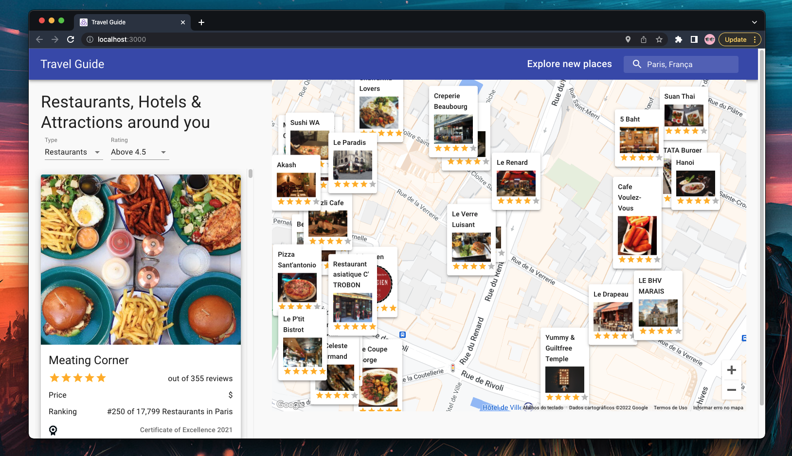

<div align="center">


# Travel Guide


Guide to the best restaurants, hotels and attractions around you.

[Preview](#preview) •
[Setup](#setup) •
[Author](#author) •
[License](#license)

</div>

## Preview

<div align="center">

</div>

## Setup

### Installation

```js
yarn install
```

### Run project

```js
yarn start
```

## Author

| [](https://github.com/higosampaio) |
| ----------------------------------------------------------------------------------------------------------------------------------- |
| [Higo Sampaio](https://github.com/higosampaio) |

## License

...
